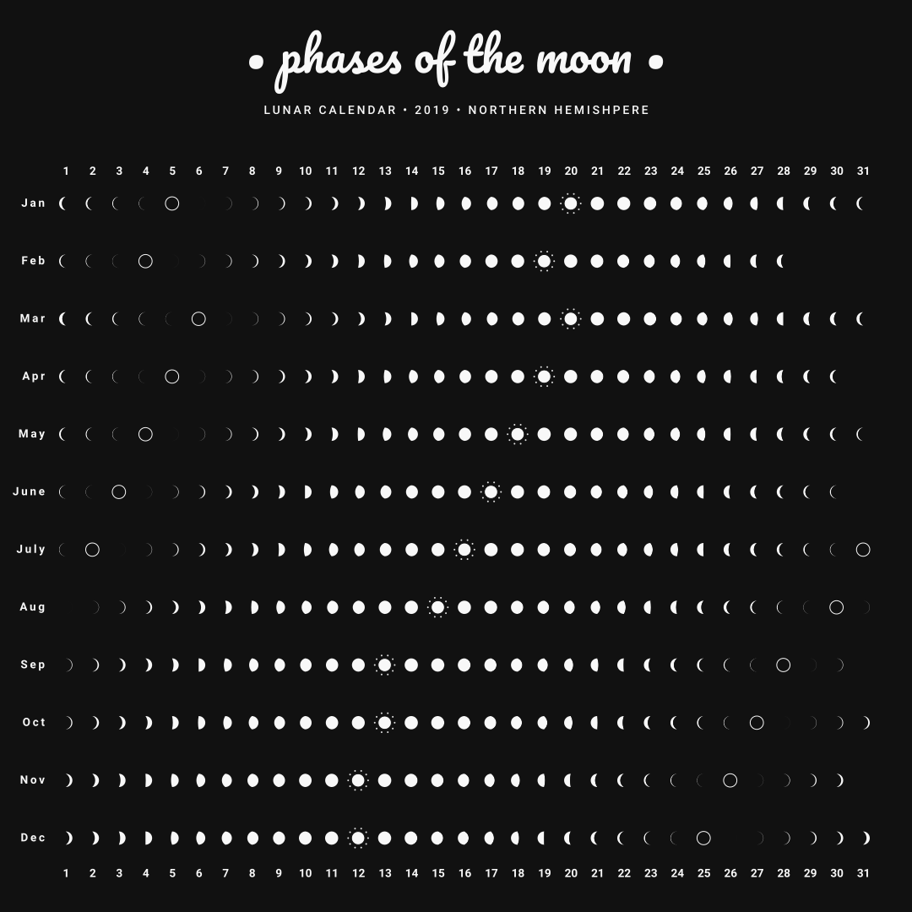
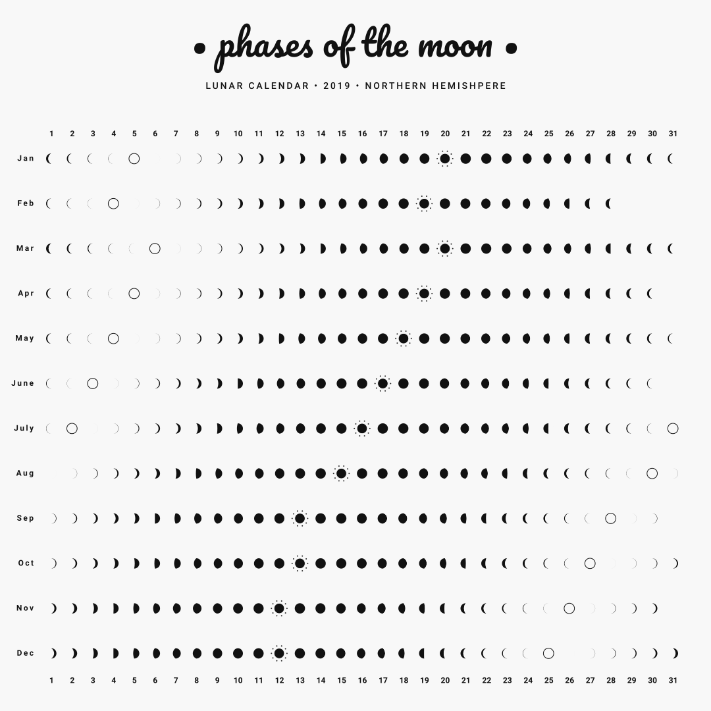

# lunar-calendar

Inspired by a random poster I found.

Lunar events taken from `@mbostock`'s tweet: https://twitter.com/mbostock/status/877946679764205568.

Lunar calculations done with [SunCalc](https://github.com/mourner/suncalc).

Crescent moon generators taken from [this lunar calendar](https://github.com/codebox/lunar-calendar).

#### 2019

*Dark*

*\*\*\**

*Light*

